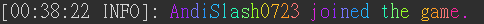
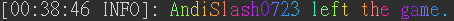
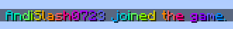
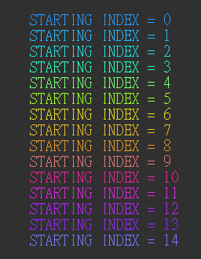

# RGB_JoinQuit_Msg

A 1.18 Minecraft plugin that creates RGB player join / quit message

## Demo

P.S: The screenshots were taken separately. So they're not the same

### Console

* Join

* Quit

### In game

* Join

* Quit

**I will add this in the future**

## Config

You can enable / disable the plugin, set the starting index (starting color) in [config.yml](./src/main/resources/config.yml)

Starting index & corresponding color:

P.S: Set starting index to `-1` to enable random starting color each time a player joins / lefts